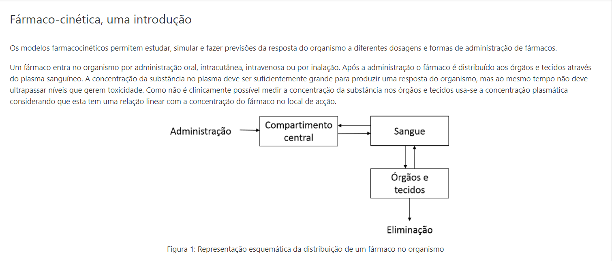
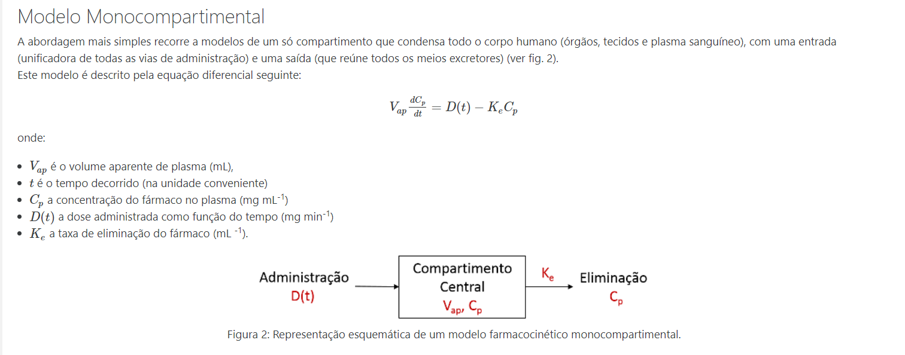
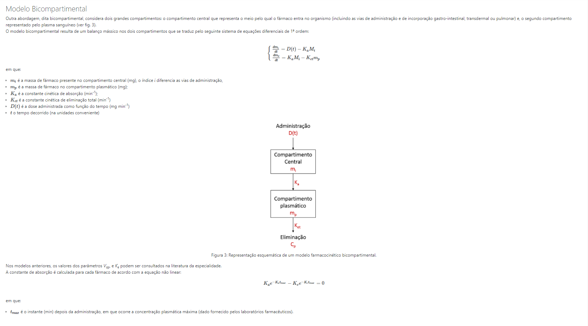
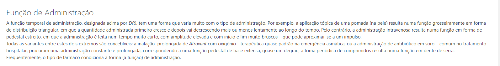
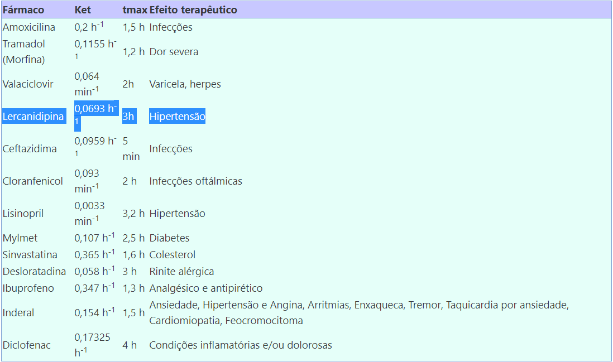

#Farmaco-cinetica

## Grupo 30

--- 

### Descrição do Trabalho

É-lhe dado um fármaco e as suas caraterísticas (ver lista de atribuição de grupos).
Modele numericamente o comportamento temporal da sua concentração no plasma sanguíneo, usando o modelo bicompartimental.
Explore, discuta e justifique:

* a. as consequências das funções de administração;
* b. as consequências dos métodos numéricos utilizados e da sua parametragem;
* c. a qualidade dos resultados;
* d. a eficiência computacional da implementação informática.

O relatório do trabalho (em formato pdf) deve conter uma parte textual contendo descrição, justificação, metodologias e conclusões, com 400 a 800 palavras.
As figuras ilustrativas devem ser adequadas e relevantes.
Devem ser entregues (em formato de texto, eventualmente comprimido) também o código e os resultados.
Identifique claramente todas as peças entregues.